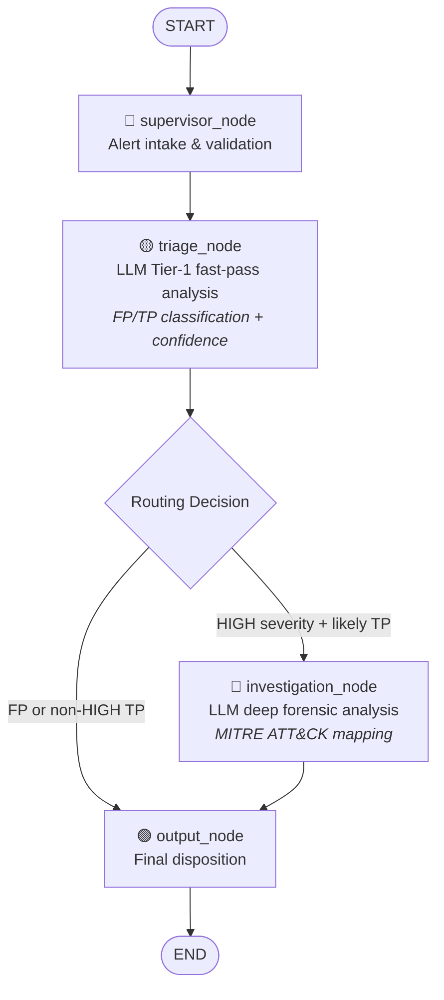

# SOC Multi-Agent System

A production-quality simulation of a Security Operations Centre (SOC) built with **LangGraph** and **LangChain**. Two independent FastAPI servers work together: a SIEM alert simulator that generates realistic security alerts, and a multi-agent pipeline that triages and investigates them.

---

## Architecture

```
┌─────────────────────────────────────────────────┐
│             SIEM Simulator  :8081               │
│                                                 │
│  GET /alerts?count=N  ──►  alert_generator.py  │
│  GET /alerts/stream   ──►  SSE stream           │
│  GET /alerts/stats    ──►  distribution counts  │
│  POST /alerts/reset   ──►  reset quota          │
└───────────────────────┬─────────────────────────┘
                        │  alert JSON
                        ▼
┌─────────────────────────────────────────────────┐
│          SOC Multi-Agent Pipeline  :8082        │
│                                                 │
│  POST /process-alert  ──►  LangGraph pipeline   │
│  POST /process-batch  ──►  batch processing     │
│  GET  /pipeline/status ─►  health + stats       │
│  GET  /pipeline/visualize ► Mermaid diagram     │
└─────────────────────────────────────────────────┘
```

### LangGraph Pipeline



---

## Project Structure

```
soc_multiagent/
├── siem_simulator/
│   ├── alert_generator.py   # Statistical alert factory — 8 categories × 3 template banks
│   └── main.py              # FastAPI server (port 8081)
├── soc_agents/
│   ├── state.py             # SOCState TypedDict with operator.add log reducer
│   ├── agents/
│   │   ├── supervisor.py    # Entry/exit nodes: alert intake + final disposition
│   │   ├── triage.py        # LLM Tier-1 fast-pass + supervisor escalation rule
│   │   └── investigation.py # LLM Tier-3 forensic analysis + MITRE ATT&CK mapping
│   ├── graph.py             # LangGraph StateGraph definition + Mermaid diagram
│   └── main.py              # FastAPI server (port 8082)
├── demo.py                  # Rich terminal demo: fetch 20 alerts → process → table
├── requirements.txt
├── .env.example
└── README.md
```

---

## Agents

### Supervisor Agent
Entry and exit node. On entry it validates alert fields and initialises pipeline state. On exit it writes the final human-readable `final_disposition` string. The escalation rule (HIGH + likely TP → investigate) is enforced by the triage node, which is the first node with access to LLM reasoning.

### Triage Agent
Rapid Tier-1 first-pass LLM analysis. Produces:
- `likely_classification`: `FP` | `TP`
- `triage_confidence`: 0.0 – 1.0
- `triage_recommendation`: `close_fp` | `monitor` | `escalate`
- `triage_summary`: 2–3 sentence analyst reasoning
- `key_indicators`: list of signals that drove the decision
- `routing_decision`: `escalate_to_investigation` | `close`

### Investigation Agent
Deep Tier-3 forensic analysis — **only called for HIGH + likely-TP alerts**. Produces:

```json
{
  "attack_stage":        "Lateral Movement",
  "mitre_technique":     "T1021.002 – SMB/Windows Admin Shares",
  "ioc_summary":         ["10.1.2.3", "ws-001.corp.local", "jsmith"],
  "recommended_response":"Isolate host and revoke Kerberos tickets immediately",
  "severity_assessment": "critical",
  "analyst_notes":       "Active pass-the-hash campaign targeting domain controller...",
  "threat_actor_profile":"APT29",
  "containment_steps":   ["Isolate host", "Revoke tokens", "Preserve memory dump"],
  "time_to_investigate": "4 minutes"
}
```

---

## Alert Distributions

The SIEM simulator produces alerts with the following statistical profile:

| Property | Distribution |
|---|---|
| Severity | HIGH 30% · MEDIUM 40% · LOW 30% |
| Ground truth | False Positive **90%** · True Positive **10%** |
| TP breakdown | Routine **70%** · Severe **30%** |

Alert templates are crafted so a competent LLM triage agent can distinguish FP from TP from linguistic cues alone:
- **FP rules** contain terms like `Authorised`, `IT`, `Scheduled`, `Backup`, `TicketID`
- **TP-severe rules** contain attack tool names (`cobalt`, `vssadmin`), CVE references, and ransomware keywords

**Categories**: `brute_force` · `malware` · `data_exfil` · `lateral_movement` · `phishing` · `policy_violation` · `recon` · `privilege_escalation`

---

## Quick Start

### Prerequisites

- Python 3.11+
- An OpenAI or Anthropic API key

### 1. Install dependencies

```bash
cd soc_multiagent
pip install -r requirements.txt
```

### 2. Configure credentials

```bash
cp .env.example .env
```

Edit `.env`:

```env
MODEL_PROVIDER=openai          # or: anthropic
OPENAI_API_KEY=sk-...          # if using openai
ANTHROPIC_API_KEY=sk-ant-...   # if using anthropic
```

### 3. Start the SIEM simulator

```bash
# Terminal A
uvicorn siem_simulator.main:app --port 8081 --reload
```

### 4. Start the SOC pipeline

```bash
# Terminal B
uvicorn soc_agents.main:app --port 8082 --reload
```

### 5. Run the integration demo

```bash
# Terminal C
python demo.py
```

The demo fetches 20 alerts from the SIEM, processes each through the SOC pipeline, and prints a colour-coded table followed by summary statistics and investigation details for any escalated alerts.

---

## API Reference

### SIEM Simulator — port 8081

| Method | Endpoint | Description |
|---|---|---|
| `GET` | `/alerts?count=N` | Return N random alerts (max 100) |
| `GET` | `/alerts/stream` | SSE stream — one alert every 2 seconds |
| `GET` | `/alerts/stats` | Current emission counts and distributions |
| `POST` | `/alerts/reset` | Reset alert counter to 0 |

**Example alert payload:**

```json
{
  "alert_id": "3f4a1b2c-...",
  "timestamp": "2025-01-15T02:15:33+00:00",
  "severity": "HIGH",
  "category": "lateral_movement",
  "source_ip": "10.4.22.81",
  "destination_ip": "10.0.0.2",
  "hostname": "ws-042.corp.local",
  "user": "jsmith",
  "rule_name": "Pass-the-Hash – NTLM Lateral Movement to Domain Controller",
  "raw_log": "Jan 15 02:15:33 ws-042 security: EventID=4624 LogonType=3 AuthPackage=NTLM user=jsmith",
  "ground_truth": "TP",
  "severity_class": "severe"
}
```

> `ground_truth` and `severity_class` are included for offline evaluation. A real SIEM would not emit these.

---

### SOC Pipeline — port 8082

| Method | Endpoint | Description |
|---|---|---|
| `POST` | `/process-alert` | Run one alert through the full pipeline |
| `POST` | `/process-batch` | Process a list of alerts sequentially |
| `GET` | `/pipeline/status` | Health check + running stats |
| `GET` | `/pipeline/visualize` | Mermaid diagram string |

**POST /process-alert — request:**

```bash
curl -s -X POST http://localhost:8082/process-alert \
  -H "Content-Type: application/json" \
  -d '{"alert": { ...alert object... }}'
```

**POST /process-alert — response (escalated alert):**

```json
{
  "alert": { "...": "..." },
  "triage_result": {
    "likely_classification": "TP",
    "triage_confidence": 0.94,
    "triage_recommendation": "escalate",
    "triage_summary": "Pass-the-hash with NTLM LogonType=3 is a strong lateral movement indicator...",
    "key_indicators": ["NTLM authentication", "LogonType=3", "external workstation name"],
    "risk_factors": ["domain controller targeted", "after-hours access"]
  },
  "investigation_report": {
    "attack_stage": "Lateral Movement",
    "mitre_technique": "T1550.002 – Pass the Hash",
    "ioc_summary": ["10.4.22.81", "ws-042.corp.local", "jsmith"],
    "recommended_response": "Isolate ws-042 and revoke jsmith's Kerberos tickets",
    "severity_assessment": "critical",
    "analyst_notes": "Classic pass-the-hash campaign...",
    "threat_actor_profile": "APT29",
    "containment_steps": ["Isolate ws-042", "Revoke all tokens for jsmith", "Preserve memory"],
    "time_to_investigate": "4 minutes"
  },
  "routing_decision": "escalate_to_investigation",
  "final_disposition": "ESCALATED-INVESTIGATED | severity=CRITICAL | stage=Lateral Movement | mitre=T1550.002",
  "processing_log": [
    "[SUPERVISOR-INIT] alert_id=3f4a1b2c severity=HIGH category=lateral_movement ...",
    "[TRIAGE] classification=TP confidence=0.94 recommendation=escalate routing=escalate_to_investigation",
    "[INVESTIGATION] attack_stage=Lateral Movement mitre=T1550.002 severity_assessment=critical",
    "[OUTPUT] final_disposition=ESCALATED-INVESTIGATED | ..."
  ]
}
```

**GET /pipeline/status:**

```json
{
  "status": "healthy",
  "graph_initialised": true,
  "stats": {
    "total_processed": 42,
    "escalated": 4,
    "closed": 38,
    "critical_findings": 2
  }
}
```

---

## Configuration

| Variable | Default | Description |
|---|---|---|
| `MODEL_PROVIDER` | `openai` | `openai` or `anthropic` |
| `OPENAI_API_KEY` | — | Required when `MODEL_PROVIDER=openai` |
| `ANTHROPIC_API_KEY` | — | Required when `MODEL_PROVIDER=anthropic` |

**Model selection:**

| Provider | Model used | Notes |
|---|---|---|
| `openai` | `gpt-4o-mini` | Fast, low-cost, good JSON compliance |
| `anthropic` | `claude-haiku-4-5-20251001` | Comparable speed and accuracy |

To use a different model, edit `_build_llm()` in [soc_agents/graph.py](soc_agents/graph.py).

---

## Consuming the SSE Stream

```python
import httpx

with httpx.stream("GET", "http://localhost:8081/alerts/stream") as r:
    for line in r.iter_lines():
        if line.startswith("data:"):
            alert = json.loads(line[5:].strip())
            if "event" not in alert:
                print(alert["alert_id"], alert["severity"], alert["category"])
```

---

## Design Notes

**Why does the escalation rule live in `triage.py` instead of `supervisor.py`?**
The supervisor's escalation rule (HIGH + likely TP → investigate) requires `triage_result`, which does not exist when the supervisor first runs. Rather than splitting the supervisor into two graph nodes, the routing decision is computed at the end of `triage_node` where the result is available. The rule is documented in both files.

**Why `operator.add` on `processing_log`?**
LangGraph replaces state fields by default. The `Annotated[list[str], operator.add]` reducer tells the graph to *append* each node's new log entries rather than overwrite the list, producing a full audit trail without nodes needing to carry forward prior entries.

**Why `asyncio.to_thread` in the FastAPI handlers?**
`graph.invoke()` is synchronous and blocks the event loop during LLM calls. Wrapping it with `asyncio.to_thread` runs it in a thread pool, keeping the FastAPI event loop responsive to concurrent requests.

---

## Evaluation with W&B Weave

### What was added

```
soc_multiagent/
├── eval/
│   ├── __init__.py
│   ├── scorers.py           ← 5 @weave.op()-decorated scorer functions
│   └── run_evaluation.py    ← full CLI evaluation script
```

### How it works

**W&B Weave** handles LLM-level tracing. Calling `weave.init(project)` auto-patches LangChain/OpenAI/Anthropic — every prompt, completion, token count, and latency appears as a child span under the `predict_alert` trace, with no changes needed in `triage.py` or `investigation.py`.

**`weave.Evaluation`** runs the pipeline on every alert and scores each prediction with all five scorers, producing a structured per-sample table in the Weave UI.

**wandb** receives the aggregate metrics as scalars, plus seven rich tables/plots: confusion matrix, per-alert results, per-category accuracy, confidence calibration, latency distribution, and a key metrics summary.

### Five scorers

| Scorer | What it measures |
|---|---|
| `triage_accuracy_scorer` | Fraction of correct FP/TP classifications |
| `false_negative_scorer` | Missed real attacks (TP classified as FP) — most dangerous failure |
| `escalation_quality_scorer` | Wasted escalations (FP → investigate) + severe TP catch rate |
| `confidence_calibration_scorer` | Is high confidence associated with correct predictions? |
| `investigation_quality_scorer` | When a report was written, is it complete (MITRE, stage, response)? |

### Running evaluation

```bash
# Add your W&B key to .env
echo "WANDB_API_KEY=your_key" >> .env

# With both servers running
python -m eval.run_evaluation --count 50

# Fully offline (no servers needed)
python -m eval.run_evaluation --count 50 --offline

# Reproducible run from saved dataset
python -m eval.run_evaluation --load-dataset eval/last_run.json

# Save dataset for future comparison runs
python -m eval.run_evaluation --count 50 --offline --save-dataset eval/baseline.json
```
